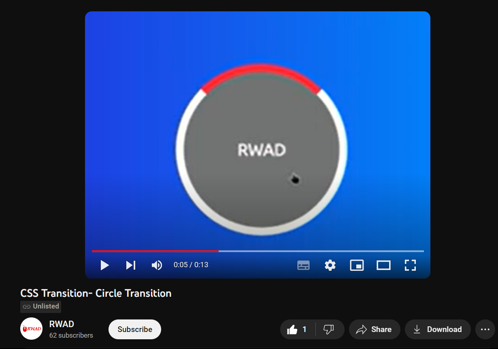

    section>div:first-child{
    width: 25%;
    aspect-ratio: 1/1;
    border-radius: 100%;
    background-color: red;

    position: absolute;
    left: 0;
    right: 0;
    margin: auto;

    transition-duration: 1.5s;
    transform-origin: bottom;
    }
    section>div:first-child:hover{
    transform: rotate(180deg);
    }

https://youtu.be/tptNcgMxHGg?si=YKZA0vzJumR-9rQ3

